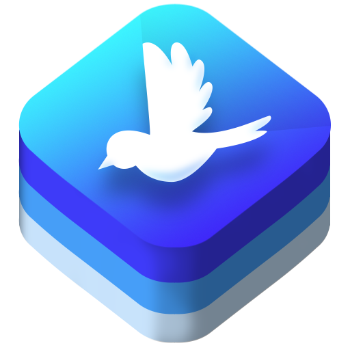

> [!NOTE]
> This project is no longer maintained.
> [Dvandva](https://github.com/david-swift/Dvandva/tree/main) is an alternative supporting multiple platforms.

<p align="center">
  
  <h1 align="center">PigeonApp</h1>
</p>

<p align="center">
  <a href="https://github.com/david-swift/PigeonApp-macOS">
  GitHub
  </a>
  ·
  <a href="Documentation/Reference/PigeonApp/README.md">
  Contributor Docs
  </a>
</p>

_PigeonApp_ contains two structures, `PigeonApp` and `PigeonDocumentApp` for replacing SwiftUI’s `WindowGroup` and `DocumentGroup` for the main window of an app. It adds commands and a settings window while being fully customizable.

![GitHub Banner][image-1]

## Table of Contents

- [Installation][1]
- [Usage][2]
- [Thanks][3]

## Installation

### Swift Package
1. Open your Swift package in Xcode.
2. Navigate to `File > Add Packages`.
3. Paste this URL into the search field: `https://github.com/david-swift/PigeonApp-macOS`
4. Click on `Copy Dependency`.
5. Navigate to the `Package.swift` file.
6. In the `Package` initializer, under `dependencies`, paste the dependency into the array.

###  Xcode Project
1. Open your Xcode project in Xcode.
2. Navigate to `File > Add Packages`.
3. Paste this URL into the search field: `https://github.com/david-swift/PigeonApp-macOS`
4. Click on `Add Package`.

## Usage

### Basic Usage
Replace `WindowGroup` with `PigeonApp` and `DocumentGroup` with `PigeonDocumentApp` in the body of your app’s main structure.

```swift
@main
struct YourApp: App {

    var body: some Scene {
        PigeonApp(appName: "YourApp", appIcon: .init(nsImage: .init(named: "AppIcon")!)) { iconFill, theme, templates in
            Text("Your App")
                .toolbar(id: "toolbar") {
                    Button("Toolbar") { }
                }
        }	
    }

}
```

There are several elements added to your app.
- The app window.
- A settings window.
	- The tab “General” in the settings window.
		- The tab “About” in the tab “General” with the app icon and name.
		- The tab “Appearance” in the tab “General” with options for customizing the color scheme behavior, icon fill and toolbar appearance. You can access the icon fill via the first closure parameter of the sidebar, content, or detail content view. _Note that a PigeonApp has to have a [customizable toolbar][4] in order to work properly. If that is not the case, [hide][5] the “General” settings tab._
	- The tab “Updates” in the settings window that only shows “You’re up-to-date!” at the moment.
- `YourApp > About YourApp` that opens the “About” tab in the “General” settings tab.
- `YourApp > Updates` that opens the “Updates” settings tab.
- `YourApp > Settings`, a menu from which you can open all the available settings tabs and subtabs.
- `View > Hide Toolbar` and `View > Customize Toolbar` for hiding and customizing your main window’s toolbar.
- All the commands that a `WindowGroup` or `DocumentGroup` adds.

### Modifiers
Use those functions as you would use SwiftUI modifiers, that means, by calling them one after another on your `PigeonApp` or `PigeonDocumentApp`.

#### Additional Information
Add a description, links, contributors and acknowledgements to the “About” tab in the “General” settings tab. The links will also appear under `Help` in the menu bar.

```swift
// ...
.information(description: "Description") {
    ("Repository", .string("https://github.com/user/repository"))
    ("Another Link", .string("https://example.com/"))
} contributors: {
    ("david-swift", .string("https://github.com/david-swift"))
} acknowledgements: {
    ("GitHub", .string("https://github.com/"))
}
// ...
```

#### Help
Add a link to your app’s help. It will appear under `Help > _` where `_` is the help’s label and in the `About` tab in the `General` settings tab.

```swift
// ...
.help("YourApp Help", link: .string("https://example.com/"))
// ...
```

#### Newest Version
Access the newest version of your app in an asynchronous function. If the newest version does not match the newest version in the version history, a button for updating is presented in the “Updates” settings tab.

```swift
// ...
.newestVersion { try await getVersions()[0] }
// ...
```

If you’re using GitHub releases and marking the latest version, use `newestVersion(gitHubUser:gitHubRepo:)` instead.

#### Version History
Add a version history to the “Updates” tab and the newest version to the “About” tab in the “General” settings tab. Note that the newest version is the highest in the result builder.

```swift
// ...
.versions {
    Version("1.0.2", date: .now) {
        Version.Feature("Cooler App Icon", description: "Update the app icon design.", icon: .app)
    }
    Version("1.0.1", date: .distantPast) {
        Version.Feature("Nicer Settings", description: "Add some settings tabs.", icon: .gearshape)
        Version.Feature("Updated Design", description: "Add rounded corners to every button.", icon: .rectangle)
    }
    Version("1.0.0", date: .distantPast) {
        Version.Feature("Initial Release", description: "YourApp is here!", icon: .partyPopper)
    }
}
// ...
```

#### Templates
Specify the default templates and thereby activate the templates settings tab. You are responsible for providing user interfaces for using the templates in your app and adding templates, while the settings provide a user interface for deleting and managing the templates and also saves them.

```swift
// ...
.templates {
    TemplateFolder(title: "Hello", icon: .handWave) {
        Template(title: "Teddy", icon: .teddybear, content: .init())
    }
}
// ...
```

To access the templates in your app, use the third closure parameter in the definition of your detail content, content, or sidebar view. Add a folder using the `PigeonAppAction.add(_:)` function and add a template to a folder using the `PigeonAppAction.add(_:to:)` function anywhere in your app.

#### Themes
Add the “Themes” settings tab by providing a preview for the themes. The preview should represent your application’s main UI. You can access the active theme using the second closure parameter in the definition of your sidebar, content, or detail content view.

```swift
// ...
.themes { theme in
    Text("That's the preview!")
        .padding()
        .foregroundColor(theme.activeTheme(scheme: scheme).primaryAccent)
        .background(theme.activeTheme(scheme: scheme).background)
}
// ...
```

#### Advanced Settings
Add the “Advanced” settings tab by defining the [subtabs][6].

```swift
// ...
.advancedSettings {
    SettingsSubtab(.init("Location", systemSymbol: .location), id: "location") {
        Text("Location")
    }
}
// ...
```

#### Behaviors Settings Tab
Add the “Behaviors” settings tab by providing behaviors titles and their function editors. You are responsible for managing the behaviors, find more information [here][7].

```swift
// ...
.behaviors {
    ("Added Task", .init($addedTask))
    ("Edited Task", .init($editedTask))
}
// ...
```

#### Synchronization Settings Tab
Let the user specify a [Supabase][8] project and table row for synchronization. Local changes are automatically written into the table row and changes on the database observed and the local value updated.

```swift
// ...
.supabase(data: $data, table: "table")
// ...
```

#### Custom Settings Tabs
Add custom settings tabs. Do not use `settings(symbolVariant:_:)`, instead, use `pigeonSettings(_:)`. Learn [here][9] more about how to define settings or extend existing tabs.

```swift
// ...
.pigeonSettings {
    SettingsTab(.init("Cool", systemSymbol: .hare), id: "cool") {
        SettingsSubtab(.noSelection, id: "tab") {
            Text("The default tab.")
        }
    }
}
// ...
```

#### Extend Subtabs
Use the modifiers `extendAboutView(content:)`, `extendAppearanceView(content:)` and `extendShortcutsView(content:)` for extending (or adding) these subtabs.

#### Hide Tabs
Hide settings tabs.

```swift
// ...
.hide(tab: .general)
// ...
```

## Thanks

### Dependencies
- [Supabase][10] licensed under the [MIT license][11]
- [ActionKit][12] licensed under the [MIT license][13]
- [SettingsKit][14] licensed under the [MIT license][15]
- [SwiftLintPlugin][16] licensed under the [MIT license][17]

### Other Thanks
- The [contributors][18]
- [SourceDocs][19] used for generating the [docs][20]
- [SwiftLint][21] for checking whether code style conventions are violated
- The programming language [Swift][22]

[1]:	#installation
[2]:	#usage
[3]:	#thanks
[4]:	https://nilcoalescing.com/blog/CustomizableToolbarOniPadInSwiftUI/#allow-toolbar-customization
[5]:	#Hide-Tabs
[6]:	https://github.com/david-swift/SettingsKit-macOS
[7]:	https://github.com/david-swift/ActionKit-macOS
[8]:	https://supabase.com
[9]:	https://github.com/david-swift/SettingsKit-macOS
[10]:	https://github.com/supabase-community/supabase-swift
[11]:	https://github.com/supabase-community/supabase-swift/blob/master/LICENSE
[12]:	https://github.com/david-swift/ActionKit-macOS
[13]:	https://github.com/david-swift/ActionKit-macOS/blob/main/LICENSE.md
[14]:	https://github.com/david-swift/SettingsKit-macOS
[15]:	https://github.com/david-swift/SettingsKit-macOS/blob/main/LICENSE.md
[16]:	https://github.com/lukepistrol/SwiftLintPlugin
[17]:	https://github.com/lukepistrol/SwiftLintPlugin/blob/main/LICENSE
[18]:	Contributors.md
[19]:	https://github.com/SourceDocs/SourceDocs
[20]:	Documentation/Reference/ColibriComponents/README.md
[21]:	https://github.com/realm/SwiftLint
[22]:	https://github.com/apple/swift

[image-1]:	Icons/GitHubBanner.png